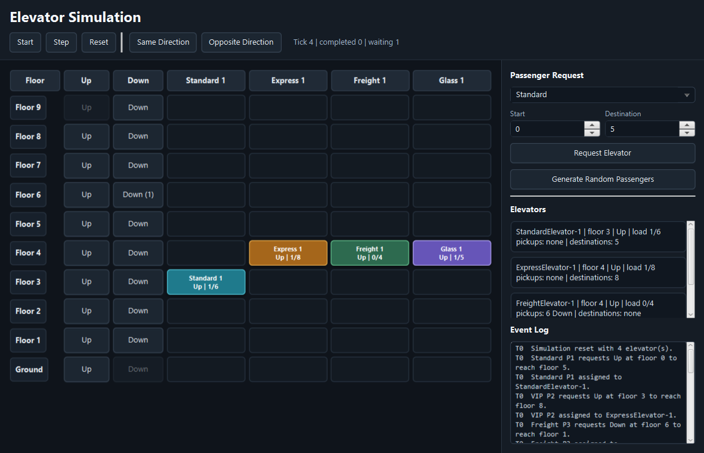
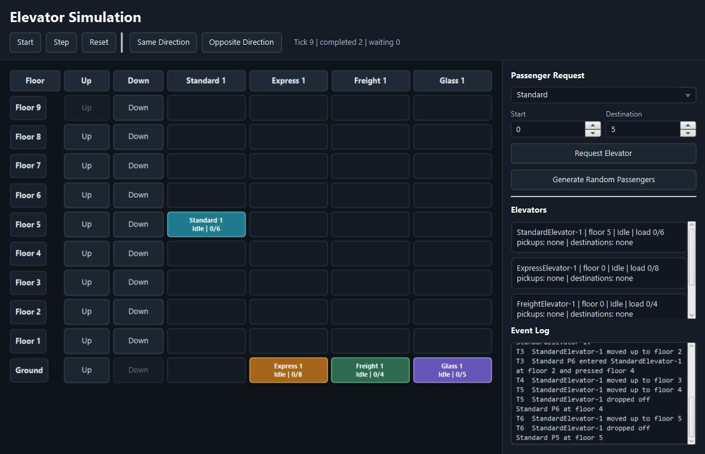
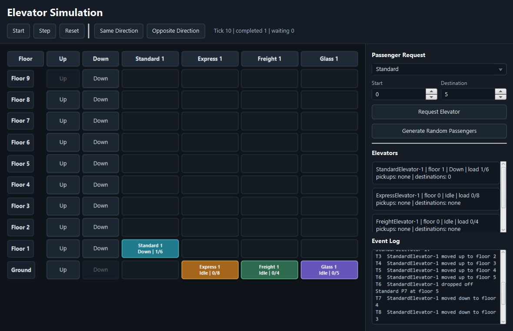

# Elevator Simulation

JavaFX elevator simulation with a SceneBuilder-compatible FXML interface, polymorphic elevator types, polymorphic passenger types, external hall requests, and internal destination requests.

## Walkthrough

<video src="docs/media/walkthrough.mp4" controls muted></video>

The walkthrough video is silent and was generated from the live JavaFX interface.

## Screenshots







## Features

- Dark JavaFX GUI built with FXML and compatible with SceneBuilder.
- Floor grid with external up/down request buttons.
- Passenger request panel for Standard, VIP, Freight, and Glass passengers.
- Standard, Express, Freight, and Glass elevator subclasses.
- External requests store source floor and direction.
- Internal requests store the selected destination floor.
- Same-direction hall calls are picked up while the elevator is already moving that way.
- Opposite-direction hall calls wait until the elevator completes the active route and returns.
- Random passenger generation based on configurable percentages.
- Step, start, pause, reset, and scenario controls.
- Event log and per-elevator status panel.

## Run

The project includes PowerShell scripts that compile directly with `javac` and the local JavaFX 24 jars.

```powershell
.\run.ps1
```

The main application class is:

```text
src/main/java/elevatorsim/ElevatorSimulationApp.java
```

## Test

Run the smoke test suite:

```powershell
.\smoke-test.ps1
```

The smoke tests verify:

- Same-direction pickup order.
- Opposite-direction deferred pickup order.
- Deterministic random traffic completion.
- Elevator floor bounds.
- No remaining external requests after the random traffic run.

## SceneBuilder

Open this file in SceneBuilder:

```text
src/main/resources/elevatorsim/ui/main-view.fxml
```

The matching controller is:

```text
src/main/java/elevatorsim/ui/SimulationController.java
```

## Generate README Assets

To regenerate the screenshots and silent walkthrough video:

```powershell
.\capture-assets.ps1
```

This script loads the real JavaFX interface, captures screenshots, renders walkthrough frames, creates `docs/media/walkthrough.mp4`, and removes temporary frame images.

## Configuration

Edit `settings.txt` to change the building and traffic profile:

```properties
floors=10
passenger.count=12
tick.millis=650

standard.elevators=1
express.elevators=1
freight.elevators=1
glass.elevators=1

standard.passenger.percent=55
vip.passenger.percent=20
freight.passenger.percent=10
glass.passenger.percent=15
```

Invalid numeric settings fall back to defaults or are clamped to safe values.

## Project Structure

```text
src/main/java/elevatorsim/model
src/main/java/elevatorsim/model/elevator
src/main/java/elevatorsim/model/passenger
src/main/java/elevatorsim/simulation
src/main/java/elevatorsim/ui
src/main/resources/elevatorsim/ui
docs/media
```

## Security And Reliability Notes

- User-editable settings are parsed as simple numeric properties and sanitized before use.
- Build scripts clean only the generated `out/classes` directory after verifying the path is inside the project.
- The simulation avoids shell execution, network access, reflection for user data, and arbitrary file loading.
- Generated README media is written only under `docs/media`.
